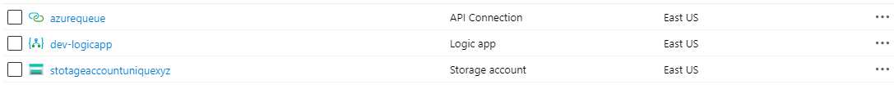
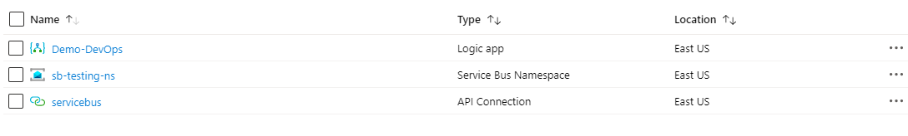
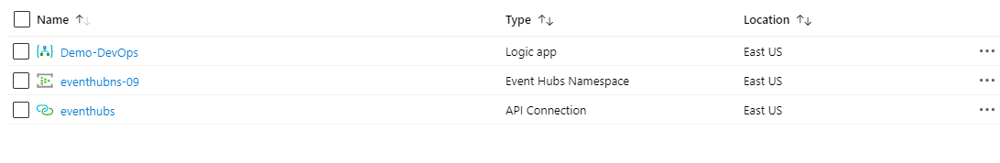
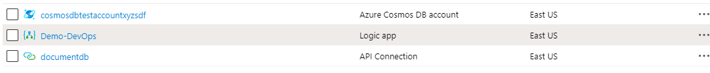
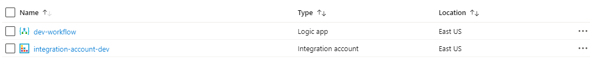
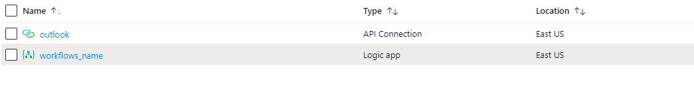
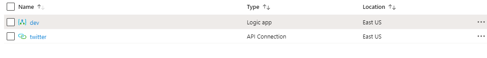
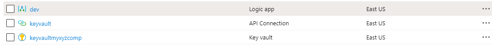
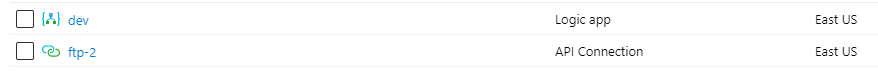

# Azure Resource Manager QuickStart Templates for Logic Apps
This repo contains all required Azure Resource Manager templates which is nesessary while development with Azure Logic App

* [AzureQueue-Connectors-LogicApp](AzureQueue-Connectors-LogicApp)

* [AzureServiceBus-Connectors-LogicApp](AzureServiceBus-Connectors-LogicApp)

* [EventHubsNamespace-Connector-LogicApp](EventHubsNamespace-Connector-LogicApp)

* [CosmosDB-Connectors-LogicApp](CosmosDB-Connectors-LogicApp)

* [IntegrationAccount-LogicApp](IntegrationAccount-LogicApp)

* [Outlook-Connectors-LogicApp](Outlook-Connectors-LogicApp)

* [Twitter-Connector-LogicApp](Twitter-Connector-LogicApp)

* [AzureKeyVault-Connector-LogicApp](AzureKeyVault-Connector-LogicApp)

* [FTP-Connector-LogicApp](FTP-Connector-LogicApp)

# Deploy Azure Queue , Logic App with Connector

# Deploy Azure Service Bus , Logic App with Connector

# Deploy Azure Event Hub , Logic App with Connector

# Deploy Azure Cosmos DB , Logic App with Connector

# Deploy Azure Integration Account, Logic App

# Deploy Azure Logic App with Outlook connector

# Deploy Azure Logic App with Twitter connector

# Deploy Azure Key Vault , Logic App with Connector

# Deploy Logic App with FTP Connector

