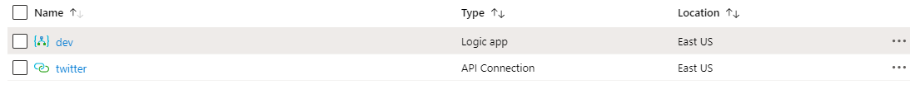

# Twitter-Connector-LogicApp
ARM Template Deployment for Twitter-Connector-LogicApp


# How to create Build Pipeline

```
trigger:
- master
name: $(Version)$(Rev:.r)
pool:
  vmImage: 'ubuntu-latest'

steps:
- script: echo Hello, world!
  displayName: 'Run a one-line script'

- script: |
    echo Add other tasks to build, test, and deploy your project.
    echo See https://aka.ms/yaml
  displayName: 'Run a multi-line script'

- task: CopyFiles@2
  inputs:
    SourceFolder: 'Twitter-Connector-LogicApp'
    Contents: '*.json'
    TargetFolder: '$(Build.ArtifactStagingDirectory)'
- task: PublishBuildArtifacts@1
  inputs:
    PathtoPublish: '$(Build.ArtifactStagingDirectory)'
    ArtifactName: 'drop'
    publishLocation: 'Container'
```

# How to create Release Pipeline 


# Deployed to Azure Portal 

